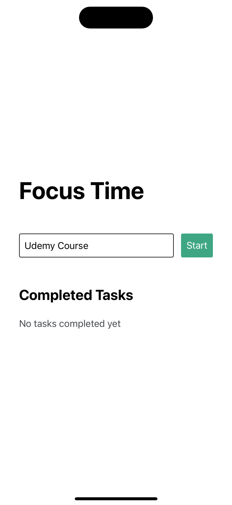

# FocusTime

An IOS and Android app to help you focus. Built in react-native using expo.

Completed as part of the [React Native in 2023: Zero to Mastery (with Hooks)](https://www.udemy.com/course/complete-react-native-mobile-development-zero-to-mastery-with-hooks/) course on Udemy.

## Requirements

- Node version 18.13.0
- [Yarn](https://classic.yarnpkg.com/lang/en/docs/install/#mac-stable)

## Getting Started

1. Clone the project:

```bash
git clone https://github.com/itsalysialynn/FocusTime.git
```

2. Install dependencies:

```bash
cd FocusTime
```

```bash
yarn install
```

3. Launch simulator.

IOS simulator:

```bash
yarn ios
```

Android simulator:

```bash
yarn android
```

## Final Product

)
